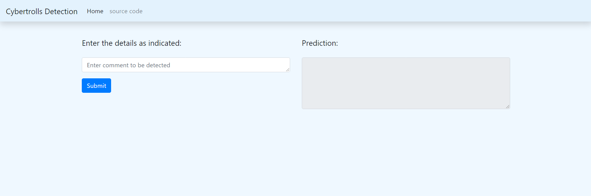

With the exponential increase of social media users, cyber bullying has been emerged as a form of bullying through electronic messages. 
Social networks provide a rich environment for bullies to uses these networks as vulnerable to attacks against victims. Given the 
consequences of cyber bullying on victims, it is necessary to find suitable actions to detect and prevent it. Recently, deep neural network-based 
models have shown significant improvement over traditional models in detecting cyberbullying. Also, new and more complex deep learning architectures 
are being developed which are proving to be useful in various NLP tasks. The model is trained and evaluated on dataset that is provided by Dataturks. 
The dataset contained 20000 tweets gathered manually annotated by human experts. Selected Twitter-based features namely text and network-based 
features were used. Several classifiers are trained for determining cyberbullying 


File structure:
```
Data: Containing orignal dataset of tweets

Data_given: contains dataset which will be stored after 
preprocesing and also contains text file for embedding

Notebooks: Contains Notebook which has code which is 
used for experimentation and finalizing ml model and pipeline

Refrences: Contains all reference papers and project documents

Src: contains file which will be used as module for web developindment
purpose

Report: Contains two file which is used for logging parametes and 
results

Saved models: which is used to save model file for api creation
```

Picture of softwares


Tox:
tox is a generic virtualenv management and test command line tool you can use for:

checking that your package installs correctly with different Python versions and interpreters

running your tests in each of the environments, configuring your test tool of choice

acting as a frontend to Continuous Integration servers, greatly reducing boilerplate and merging CI and shell-based testing.


create env

```terminal
conda create -n cyberbullying3 python=3.8 -y
```

activate env

```terminal
conda activate cyberbullying3
```

created a requirements.txt file

install the requirements
```terminal
pip install -r requirements.txt
```

git init

dvc init

dvc add data_given\cybertrolls.json

to download data use command

```
dvc pull 
```
Ml flow tracks all artifacts like dvc but it gives 
a proper ui it also keeps track of enviorment it creates
db
running mlfow server

mlflow server --backend-store-uri sqlite:///mlflow.db --default-artifact-root ./artifacts --host 127.0.0.1 -p 1234